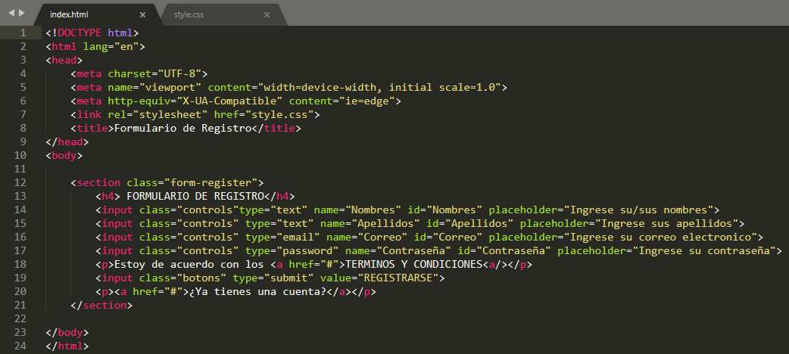
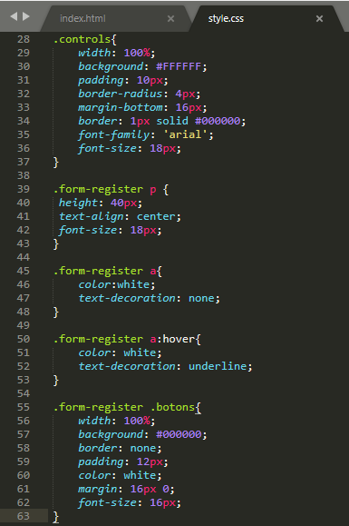
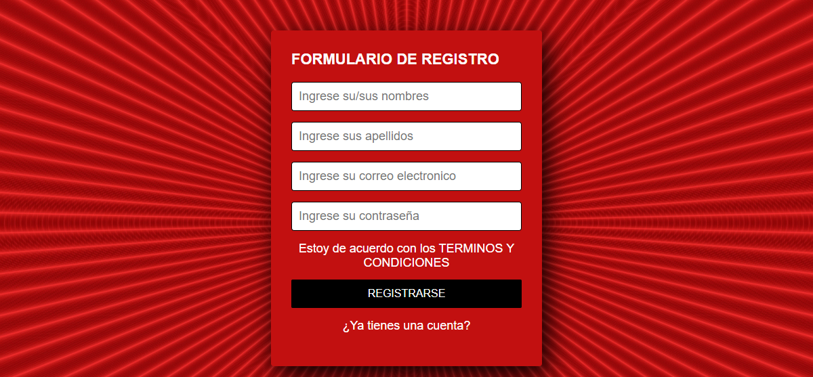
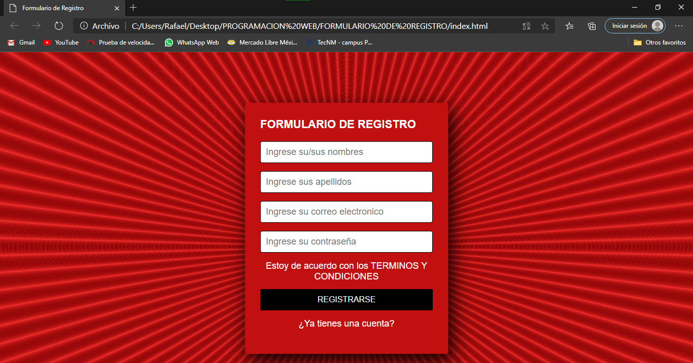
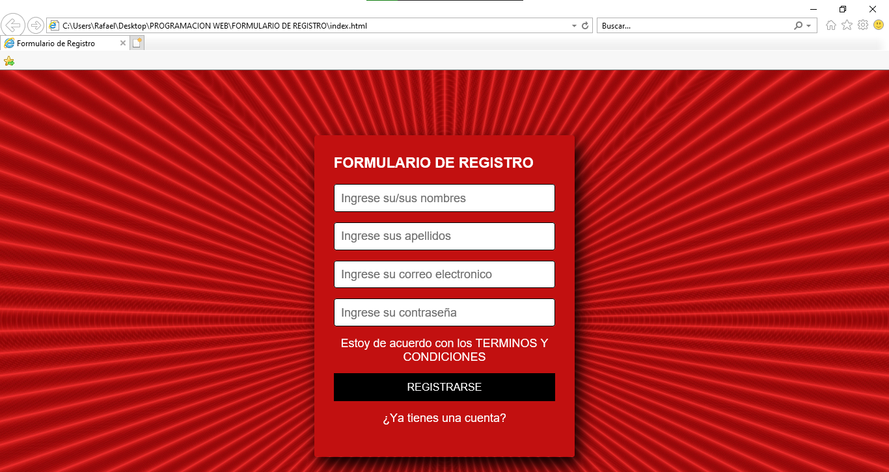

# PRACTICA2-FORMULARIO
# En la siguiente practica lleve a cabo la elaboracion de una pagina web estatica implementando estilos, aplicando herencia, y agrupando selectores, la cual fue verificada en los distintos navegadores web.
# 1. Para comenzar, he creado la pagina web con HTML, la cual carece de un diseño que nos aporta el CSS.

# 2. Una vez hecho el formulario, viene la parte de darle un retoque mediante CSS creando un nuevo fichero con extension .css tal y como se muestra en las siguientes imagenes

# 3. Asi es como quedaria el formulario aplicando este cambio, como se puede ver, la mejora es muy notable, dandole un efecto de "suavizado".

# Ahora procedo a comprobar que se muestre la pagina web estatica en los distintos navegadores web que tengo instalados
# Microsoft Edge

# Internet Explorer

