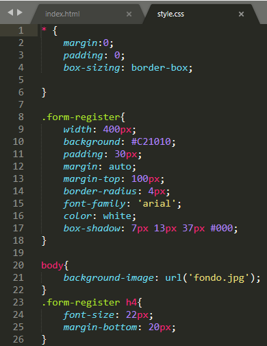

# PRACTICA2-FORMULARIO
# En la siguiente practica lleve a cabo la elaboracion de una pagina web estatica implementando estilos, aplicando herencia, y agrupando selectores, la cual fue verificada en los distintos navegadores web.
# 1. Para comenzar, he creado la pagina web con HTML, la cual carece de un diseño que nos aporta el CSS.

# 2. Una vez hecho el formulario, viene la parte de darle un retoque mediante CSS tal y como se muestra en las siguientes imagenes

